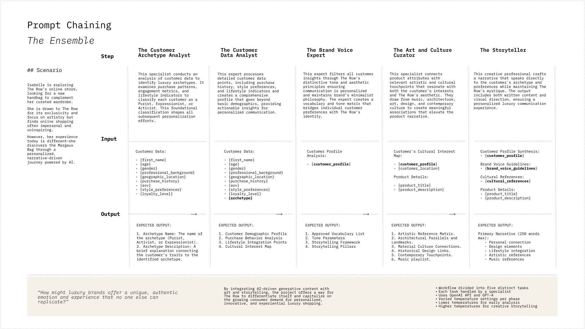

# Generative AI Storytelling for The Row

## Overview

This repository contains a Generative AI-powered storytelling case study for the luxury fashion brand **The Row**. It employs **prompt chaining**, a technique that structures AI-generated content through multiple sequential steps to produce a refined, personalized narrative. The case study focuses on **customer archetypes, data analysis, brand voice refinement, cultural curation, and luxury storytelling**, culminating in a rich and immersive AI-driven luxury fashion experience.

## Prompt Chaining: Five-Step Process

### 1. Configuration: AI Model Setup

- Utilizes **Ollama + Llama Model**.
- Two AI instances:
  - `llm_analyst`: Analytical processing (Phases 1-4, temp=0, high context window).
  - `llm_storyteller`: Narrative generation (Phase 5, temp=0.7, high context window).

### 2. Define Prompt Templates for Each Phase

Each phase uses structured prompt templates to guide AI responses. The dataset consists of **customer profiles, product details, and brand voice parameters** to ensure luxury brand consistency.

## Detailed Process

### **Phase 1: Customer Archetype Analyst**

- Inputs: Customer demographic details, purchase behavior, style preferences.
- Output: Assigns an **archetype** (Purist, Activist, Expressionist) based on luxury shopping patterns.

### **Phase 2: Customer Data Analyst**

- Inputs: Customer archetype, purchase history, lifestyle habits.
- Output: Generates a **detailed customer profile**, breaking down **purchase behavior, lifestyle integration, and cultural interest maps**.

### **Phase 3: Brand Voice Expert for The Row**

- Inputs: Customer profile.
- Output: Aligns customer insights with **The Row's brand voice**, defining:
  1. Approved Vocabulary List
  2. Tone Parameters
  3. Storytelling Framework
  4. Storytelling Pillars

### **Phase 4: Art and Culture Curator for The Row**

- Inputs: Customer cultural interests, product design elements.
- Output: Develops cultural and artistic connections by mapping **art movements, architecture, materials, historical design, and contemporary touchpoints**.

### **Phase 5: Luxury Storytelling**

- Inputs: Customer profile, brand voice guidelines, cultural references, product details.
- Output: Crafts a **personalized, brand-aligned narrative** integrating cultural sophistication, tactile luxury, and timeless storytelling.

## Key Features

- **Luxury-Specific AI Personalization**: Generates tailored storytelling aligned with luxury consumer preferences.
- **Cultural and Artistic Integration**: Enhances product narratives with art history, architecture, and musical references.
- **Minimalist and Sophisticated Brand Language**: Ensures The Row’s quiet luxury aesthetic is preserved.
